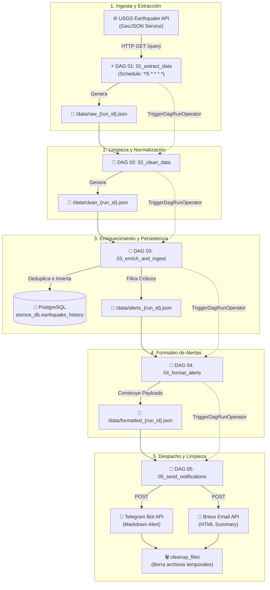
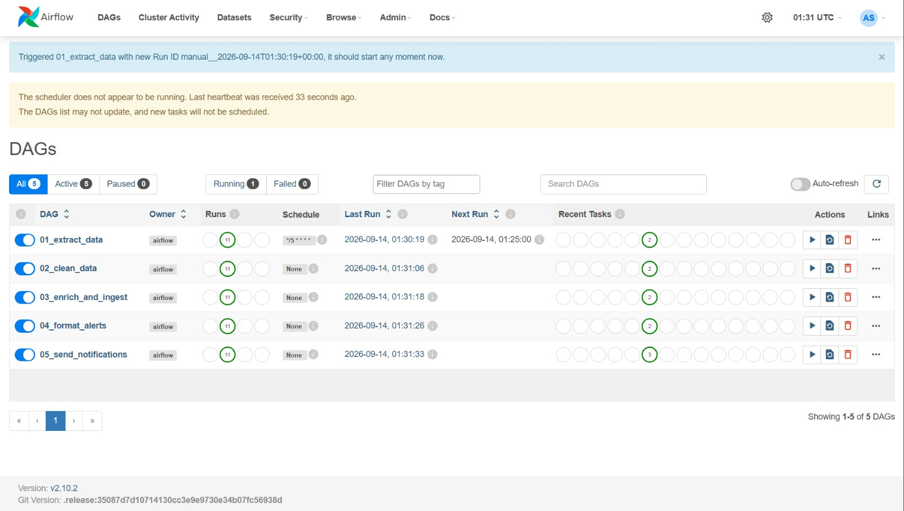

# 🌍 USGS Earthquake Monitoring & Alert Pipeline with Apache Airflow


Pipeline de ingeniería de datos distribuido y orientado a eventos, orquestado con **Apache Airflow**. Consume periódicamente la API oficial del Servicio Geológico de los Estados Unidos (**USGS**), transforma y normaliza datos sísmicos globales, realiza enriquecimiento geoespacial (cálculo de proximidad y umbrales de magnitud), persiste los eventos históricos en **PostgreSQL**, y despacha notificaciones automáticas y multicanal en tiempo real (**Telegram** y correo electrónico vía **Brevo**).

---

## 🏗️ Arquitectura del Sistema

El sistema implementa un patrón desacoplado y modular de **Chained DAGs** (DAGs encadenados orientados a micro-tareas ETL) interconectados a través de `TriggerDagRunOperator`, compartiendo identificadores de ejecución (`source_run_id`) para trazabilidad, almacenamiento intermedio y deduplicación.



### Componentes Clave

1. **Fuente de Datos Externa**: API REST pública de [USGS Earthquakes](https://earthquake.usgs.gov/fdsnws/event/1/), consultada en intervalos continuos o ventanas históricas.
2. **Orquestador (Apache Airflow 2.10.2)**: Configurado con `LocalExecutor`, gestiona la planificación, reintentos, dependencias entre DAGs y observabilidad.
3. **Almacenamiento Temporal (Data Staging)**: Volumen compartido montado en `/opt/airflow/data`, donde se leen y escriben payloads JSON por lote identificados con `run_id`.
4. **Base de Datos Analítica (PostgreSQL 13)**: Almacén relacional (`sismos_db`) con tabla dedicada `earthquake_history` que preserva el histórico libre de duplicados.
5. **Capa de Notificación**:
   - **Telegram Bot API**: Notificaciones push instantáneas con formato Markdown y enlaces directos a la ficha del evento en USGS.
   - **Brevo API (v3)**: Despacho de resúmenes HTML a listas de distribución de correo electrónico.
6. **Infraestructura Contenerizada**: Docker y Docker Compose con healthchecks automáticos para PostgreSQL, Webserver y Scheduler.

---

## ⚙️ Detalle Completo de los DAGs

El pipeline divide el ciclo de vida de los datos en cinco DAGs independientes. Esta modularidad favorece el mantenimiento, la depuración granular, la tolerancia a fallos y la ejecución desacoplada.

```
dags/
├── 01_extract_data.py          # Extracción desde API USGS y chunking
├── 02_clean_data.py            # Limpieza, aplanado de GeoJSON y casting
├── 03_enrich_and_ingest.py     # Lógica espacial, categorización e inserción en DB
├── 04_format_alerts.py         # Renderizado de plantillas de alerta
└── 05_send_notifications.py   # Despacho en paralelo a Telegram/Brevo y housekeeping
```

### 1. `01_extract_data`
* **Archivo**: [`dags/01_extract_data.py`](dags/01_extract_data.py)
* **Programación (Schedule)**: `*/5 * * * *` (Cada 5 minutos) | `catchup=False`.
* **Propósito**: Extrae los sismos registrados por el USGS dentro de un rango temporal.
* **Mecanismo de Ejecución**:
  - **Ejecución Periódica**: Por defecto consulta la ventana entre `data_interval_end - 1 día` y `data_interval_end`.
  - **Soporte de Backfill / Rango Personalizado**: Lee parámetros opcionales pasados en la configuración del DAG Run (`conf["start_date"]` y `conf["end_date"]`).
  - **Chunking Temporal**: Fragmenta rangos amplios en bloques máximos de 7 días para no exceder los límites de payload y timeout de la API de USGS.
* **Artefacto Producido**: `/opt/airflow/data/raw_{run_id}.json` (formato GeoJSON `FeatureCollection`).
* **Siguiente Paso**: Invoca `02_clean_data` vía `TriggerDagRunOperator`, pasando `source_run_id`.

---

### 2. `02_clean_data`
* **Archivo**: [`dags/02_clean_data.py`](dags/02_clean_data.py)
* **Programación (Schedule)**: `None` (Activado exclusivamente por DAG 1).
* **Propósito**: Transforma el GeoJSON semiestructurado en un conjunto de registros tabulares planos y limpios.
* **Transformaciones Aplicadas**:
  - Aplana la estructura anidada de `geometry.coordinates` `[lon, lat, depth]`.
  - Convierte la marca de tiempo de milisegundos (`properties.time`) a formato estándar ISO 8601 UTC.
  - Normaliza campos esenciales: `id`, `magnitude`, `place`, `time`, `url`, `longitude`, `latitude`, `depth`.
* **Artefacto Producido**: `/opt/airflow/data/clean_{source_run_id}.json`.
* **Siguiente Paso**: Invoca `03_enrich_and_ingest` transmitiendo el `source_run_id`.

---

### 3. `03_enrich_and_ingest`
* **Archivo**: [`dags/03_enrich_and_ingest.py`](dags/03_enrich_and_ingest.py)
* **Programación (Schedule)**: `None` (Activado por DAG 2).
* **Propósito**: Enriquecimiento geoespacial, deduplicación de registros, persistencia relacional y detección de alertas críticas.
* **Lógica de Negocio y Enriquecimiento**:
  - **Creación idempotente de tabla**: Garantiza la existencia de la tabla `earthquake_history` en PostgreSQL.
  - **Deduplicación**: Consulta los IDs existentes en base de datos para ignorar eventos previamente procesados (`SELECT id FROM earthquake_history`).
  - **Cálculo de Proximidad**: Determina la distancia planar aproximada hacia la ciudad de Quito, Ecuador (`lat: -0.1807`, `lon: -78.4678`):
    $$\text{distancia (km)} \approx \sqrt{(\Delta \text{lat})^2 + (\Delta \text{lon})^2} \times 111$$
  - **Criterios de Alerta**:
    - **Alta Magnitud**: `magnitude >= 6.0` $\rightarrow$ Motivo: `💥 Magnitud Alta`.
    - **Cercanía Geográfica**: $\text{distancia} \le 300\text{ km}$ de Quito $\rightarrow$ Motivo: `🇪🇨 Cerca de Quito`.
  - **Persistencia**: Inserción parametrizada en PostgreSQL de los nuevos eventos con sus flags booleanas (`is_high_mag`, `is_near_quito`).
* **Artefacto Producido**: `/opt/airflow/data/alerts_{source_run_id}.json` conteniendo únicamente los sismos que requieren notificación inmediata.
* **Siguiente Paso**: Invoca `04_format_alerts`.

---

### 4. `04_format_alerts`
* **Archivo**: [`dags/04_format_alerts.py`](dags/04_format_alerts.py)
* **Programación (Schedule)**: `None` (Activado por DAG 3).
* **Propósito**: Construcción y diseño de los mensajes para los canales finales de comunicación.
* **Canales y Formatos**:
  - **Telegram (`formatted["telegram"]`)**: Genera una lista de mensajes individuales en Markdown enriquecido con emojis informativos, ubicación, magnitud, profundidad, fecha/hora y link oficial.
  - **Email (`formatted["email"]`)**: Genera una lista HTML consolidada (`<ul><li>...</li></ul>`) con el resumen de sismos relevantes del lote actual.
* **Artefacto Producido**: `/opt/airflow/data/formatted_{source_run_id}.json`.
* **Siguiente Paso**: Invoca `05_send_notifications`.

---

### 5. `05_send_notifications`
* **Archivo**: [`dags/05_send_notifications.py`](dags/05_send_notifications.py)
* **Programación (Schedule)**: `None` (Activado por DAG 4).
* **Propósito**: Distribución en paralelo de alertas por mensajería/email y recolección de basura del sistema de archivos.
* **Topología de Tareas**:
  ```
  [ send_telegram , send_email ] >> cleanup_files
  ```
* **Comportamiento**:
  - `send_telegram`: Despacha cada mensaje vía llamada POST a la API de Telegram Bot.
  - `send_email`: Envía el correo mediante la API REST v3 de Brevo a los destinatarios configurados en `ALERT_EMAIL`.
  - `cleanup_files`: Tarea de housekeeping con `TriggerRule.ALL_DONE`. Elimina los ficheros temporales `raw_*`, `clean_*`, `alerts_*` y `formatted_*` asociados al `source_run_id` para evitar saturación del disco.

---

## 🗄️ Modelo de Datos (PostgreSQL)

Los datos consolidados se almacenan en la base de datos `sismos_db` dentro del contenedor PostgreSQL:

```sql
CREATE TABLE IF NOT EXISTS earthquake_history (
    id             VARCHAR PRIMARY KEY, -- Identificador único oficial de USGS (ej. us7000abcd)
    magnitude      FLOAT,               -- Magnitud del sismo (Escala Richter / Momento)
    place          VARCHAR,             -- Descripción textual de la zona geográfica
    time           VARCHAR,             -- Timestamp UTC en formato ISO 8601
    url            VARCHAR,             -- Enlace a la página del evento en USGS
    latitude       FLOAT,               -- Latitud decimal (-90 a 90)
    longitude      FLOAT,               -- Longitud decimal (-180 a 180)
    depth          FLOAT,               -- Profundidad del hipocentro en kilómetros
    is_high_mag    BOOLEAN,             -- Flag indicativa si magnitud >= 6.0
    is_near_quito  BOOLEAN              -- Flag indicativa si dist(Quito) <= 300 km
);
```

---

## 🚀 Despliegue y Puesta en Marcha

### Requisitos Previos
* **Docker Desktop** (versión 20.10+) o Docker Engine con Docker Compose v2+.
* Cuenta y Token de **Telegram Bot** (creado vía [@BotFather](https://t.me/botfather)).
* Cuenta en **Brevo (Sendinblue)** con API Key v3 y remitente verificado.

### 1. Clonación y Variables de Entorno
Copia el archivo de variables de ejemplo y define tus credenciales:

```bash
git clone <url-del-repositorio>
cd airflow_sismos
cp .env.example .env
```

Edita `.env` con tus credenciales:
```env
# --- Configuración Base de Airflow ---
AIRFLOW_UID=50000
AIRFLOW_PROJ_DIR=.
_PIP_ADDITIONAL_REQUIREMENTS=pandas requests psycopg2-binary
_AIRFLOW_WWW_USER_USERNAME=airflow
_AIRFLOW_WWW_USER_PASSWORD=airflow

# --- Credenciales de Notificaciones ---
TELEGRAM_BOT_TOKEN=tu_token_aqui
TELEGRAM_CHAT_ID=tu_chat_id_aqui
BREVO_API_KEY=tu_brevo_api_key
BREVO_SENDER_EMAIL=remitente_verificado@tudominio.com
ALERT_EMAIL=analista1@empresa.com, analista2@empresa.com
```

### 2. Inicialización y Ejecución
Levanta el ecosistema completo en segundo plano:

```bash
docker-compose up -d --build
```

El servicio `airflow-init` inicializará la base de datos de metadatos, aplicará las migraciones, creará el usuario administrador `airflow` y preparará los directorios con los permisos requeridos.

### 3. Acceso a la Interfaz Web
* **Airflow UI**: [http://localhost:8080](http://localhost:8080)
  - **Usuario**: `airflow`
  - **Contraseña**: `airflow`
* **PostgreSQL**: `localhost:5432` | DB: `sismos_db` | User: `airflow` | Pass: `airflow`

### 4. Ejecución Manual con Backfilling (Opcional)
Para procesar un intervalo histórico arbitrario, dispara el DAG `01_extract_data` desde la interfaz o por CLI pasando un JSON de configuración:

```json
{
  "start_date": "2024-01-01T00:00:00Z",
  "end_date": "2024-01-15T00:00:00Z"
}
```

---

## 📸 Evidencias de Ejecución



---

## 🔮 Futuro Trabajo y Mejoras Posibles

Para evolucionar este proyecto hacia una plataforma de grado de producción de alta disponibilidad, se identifican las siguientes líneas de trabajo futuro:

### 1. Ingesta en Streaming de Baja Latencia (Real-Time Ingestion)
* **Apache Kafka / Redpanda**: Sustituir el polling por batch de 5 minutos por un conector productor Kafka que consuma el feed WebSocket o SSE de USGS en tiempo real.
* **Motor de Procesamiento Continuo**: Incorporar **Apache Flink** o **Faust** para aplicar ventanas deslizantes de detección de réplicas en segundos tras el sismo principal.

### 2. Cálculos Geoespaciales Avanzados y PostGIS
* **Migración a PostGIS**: Habilitar la extensión espacial `postgis` en PostgreSQL para utilizar tipos nativos `GEOMETRY(Point, 4326)` e índices espaciales `GIST`.
* **Fórmula de Haversine y Geodesia Elipsoidal**: Reemplazar la aproximación euclidiana por `ST_DistanceSphere` o la fórmula de Vincenty para cálculo exacto de distancias sobre el esferoide terrestre.
* **Zonificación por Fallas Tectónicas y Poblaciones**: Cruzar los epicentros con capas cartográficas (Shapefiles / GeoJSON) de densidad poblacional y fallas geológicas activas para calcular el índice de riesgo sísmico estimado.

### 3. Capa de Visualización y Business Intelligence (BI)
* **Dashboard Interactivo con Apache Superset / Metabase**: Conectar una herramienta analítica a `earthquake_history` para generar:
  - Mapas de calor (Heatmaps) con clusters sísmicos.
  - Histogramas de frecuencia de magnitud y profundidad hipocentral.
  - Series temporales de sismicidad acumulada por región y país.
* **Aplicación Web React / Mapbox GL**: Portal web público con visualización 3D del relieve y foco sísmico según la profundidad registrada.

### 4. Inteligencia Artificial y Machine Learning
* **Clustering No Supervisado (DBSCAN / HDBSCAN)**: Identificar enjambres sísmicos e hiper-concentraciones anómalas de micro-sismos previos a eventos de mayor escala.
* **Estimación de Aceleración Máxima del Suelo (PGA)**: Modelar la atenuación de ondas sísmicas mediante funciones empíricas para predecir el impacto potencial en infraestructura crítica según el tipo de suelo.

### 5. Calidad de Datos, Linaje y Observabilidad
* **Validación Automática con Great Expectations o Soda**: Añadir tareas de verificación entre DAGs (validar rangos válidos de magnitud $[-1.0, 10.0]$, coordenadas acotadas y no nulidad).
* **OpenLineage / Marquez**: Rastrear el linaje de datos de extremo a extremo desde el payload de USGS hasta las filas persistidas en PostgreSQL.
* **Alertas de Fallo de Infraestructura**: Enviar notificaciones a PagerDuty / Slack en caso de que alguna tarea de Airflow falle o la API de USGS devuelva códigos 5xx.

### 6. Despliegue Cloud Nativo e Infraestructura como Código (IaC)
* **Terraform**: Provisionar la infraestructura en AWS (MWAA + Amazon RDS PostgreSQL) o GCP (Cloud Composer + Cloud SQL).
* **Kubernetes (K8s) & Helm**: Migrar a `KubernetesExecutor` o `CeleryKubernetesExecutor`, permitiendo que cada tarea se ejecute en un Pod efímero aislado con escalabilidad horizontal automática.

